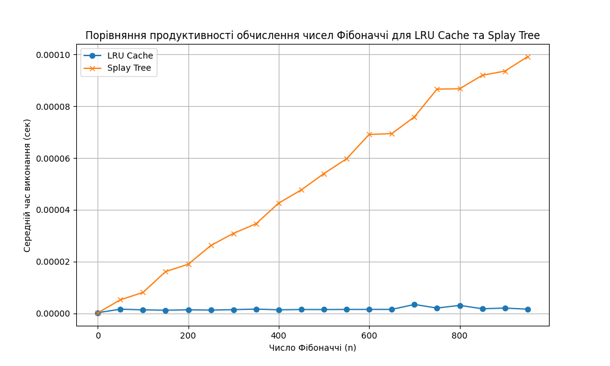

## Завдання 1. Оптимізація доступу до даних за допомогою LRU-кешу

Реалізуйте програму для оптимізації обробки запитів до масиву чисел за допомогою `LRU-кешу`.

**Технічні умови**

1. Дано масив розміром `N`, який складається з позитивних цілих чисел `(1 ≤ N ≤ 100_000)`. Потрібно обробити `Q` запитів `(1 ≤ Q ≤ 50_000)` такого типу:

- `Range(L, R)` — знайти суму елементів на відрізку від індексу `L` до `R` включно.
- `Update(index, value)` — замінити значення елемента в масиві за індексом `index` на нове значення `value`.

2. Реалізуйте чотири функції для роботи з масивом:

- `range_sum_no_cache(array, L, R)`
  Функція має обчислювати суму елементів масиву на відрізку від `L` до `R` включно **без використання кешу**. Для кожного запиту результат має обчислюватися заново.

- `update_no_cache(array, index, value)`
  Функція має оновлювати значення елемента масиву за вказаним індексом **без використання кешу**.

- `range_sum_with_cache(array, L, R)`
  Функція має обчислювати суму елементів на відрізку від `L` до `R` включно, використовуючи **LRU-кеш**. Якщо сума для цього відрізку вже була обчислена раніше, вона має повертатися з кешу, інакше результат обчислюється та додається в кеш.

- `update_with_cache(array, index, value)`
  Функція має оновлювати значення елемента масиву за вказаним індексом і видаляти всі відповідні значення з кешу, які стали неактуальними через зміну в масиві.

3. Для тестування програми створіть масив розміром `100_000` елементів, заповнених випадковими числами, і згенеруйте `50_000` запитів типу `Range` та `Update` у випадковому порядку.

Приклад списку запитів: `[('Range', 46943, 91428), ('Range', 5528, 29889), ('Update', 77043, 78), ...]`

4. Використовуйте `LRU-кеш` розміром `K = 1000` для зберігання попередньо обчислених результатів запитів типу `Range`. Кеш повинен автоматично видаляти найменш недавно використані елементи, якщо досягається його максимальний розмір.

5. Здійсніть порівняння часу виконання запитів:

- Без використання кешу.
- З використанням LRU-кешу.

Виведіть результати у вигляді часу виконання для обох підходів.

**Приклад виведення в термінал виконання програми**

```
Час виконання без кешування: 3.11 секунд
Час виконання з LRU-кешем: 0.02 секунд
```

**Результат**


## Завдання 2. Порівняння продуктивності обчислення чисел Фібоначчі із використанням LRU-кешу та Splay Tree

Реалізуйте програму для обчислення чисел Фібоначчі двома способами: із використанням `LRU-кешу` та з використанням `Splay Tree` для збереження попередньо обчислених значень. Проведіть порівняльний аналіз їхньої ефективності, вимірявши середній час виконання для кожного з підходів.

**Технічні умови**

1. Реалізуйте дві функції для обчислення чисел Фібоначчі:

- `fibonacci_lru(n)`
  Функція має використовувати декоратор `@lru_cache` для кешування результатів обчислень. Завдяки цьому вона може повторно використовувати попередньо обчислені значення чисел Фібоначчі.

- `fibonacci_splay(n, tree)`
  Функція використовує структуру даних `Splay Tree` для збереження обчислених значень. Якщо число Фібоначчі для заданого `n` уже було обчислене, значення має повертатися з дерева, інакше значення обчислюється, зберігається у `Splay Tree` і повертається.

2. Виміряйте час виконання обчислення чисел Фібоначчі для кожного з підходів:

- Створіть набір чисел Фібоначчі від 0 до 950 з кроком 50: 0, 50, 100, 150, ....
- Використовуйте модуль `timeit` для вимірювання часу виконання обчислень.
- Для кожного значення `n` обчисліть середній час виконання обчислення числа Фібоначчі з використанням `LRU-кешу` та `Splay Tree`.

3. Побудуйте графік, який порівнює час виконання для двох підходів:

- Використовуйте бібліотеку `matplotlib` для побудови графіка.
- На осі `x` відобразіть значення `n` — номер числа Фібоначчі.
- На осі `y` — середній час виконання в секундах.
- Додайте на графік легенду, яка вказує на два підходи: `LRU Cache` та `Splay Tree`.

4. Зробіть висновки щодо ефективності обох підходів на основі отриманого графіка.

5. Додатково до побудови графіка виведіть текстову таблицю, яка містить значення `n`, середній час виконання для `LRU Cache` та `Splay Tree`. Таблиця повинна бути відформатована для зручного читання.

**Результат**




### Висновок

Метод `LRU Cache` демонструє значно кращу продуктивність для великих значень `n` у порівнянні зі `Splay Tree`. Це пов’язано з тим, що `LRU Cache` використовує ефективне хешування для доступу до вже обчислених значень, тоді як `Splay Tree` потребує виконання операцій ротації для доступу до вузлів. Таким чином, `LRU Cache` є більш оптимальним для завдань, де часто використовуються повторні виклики з однаковими параметрами.
